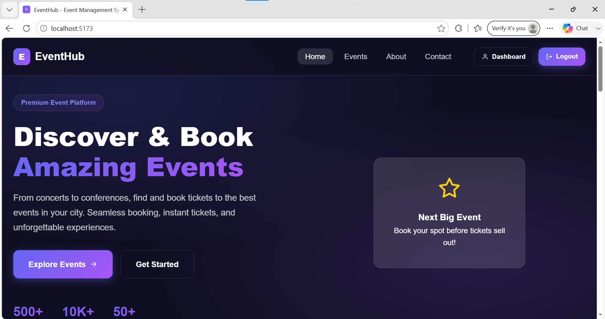
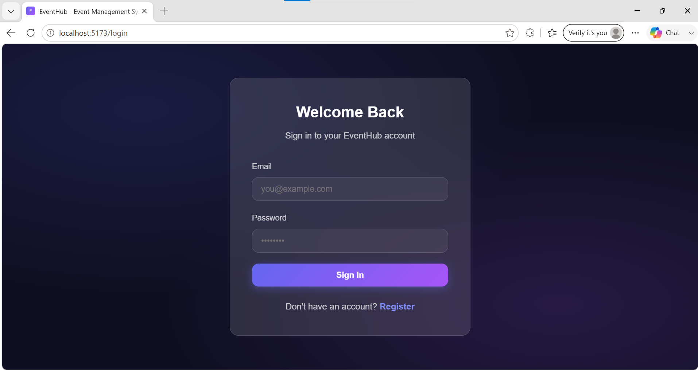
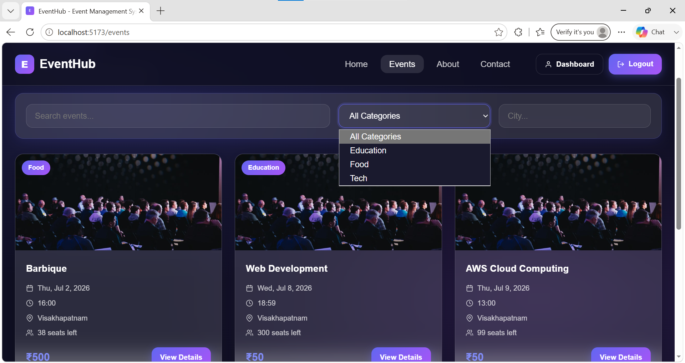
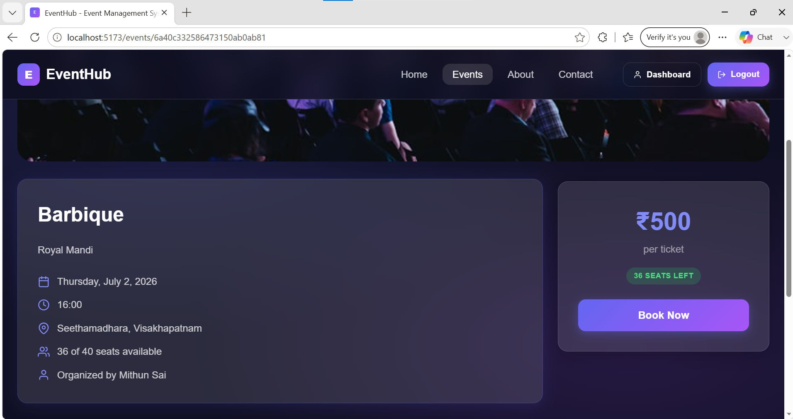
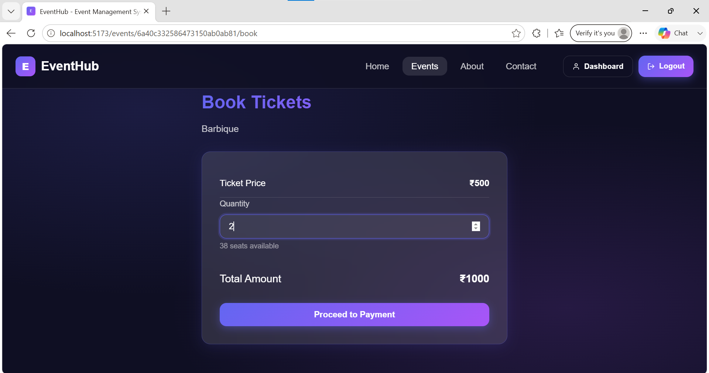
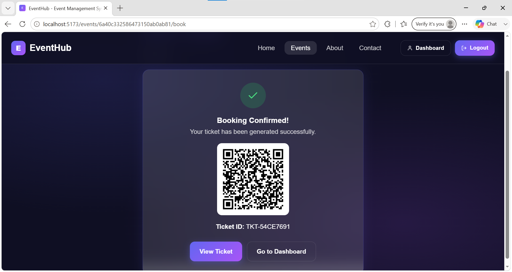
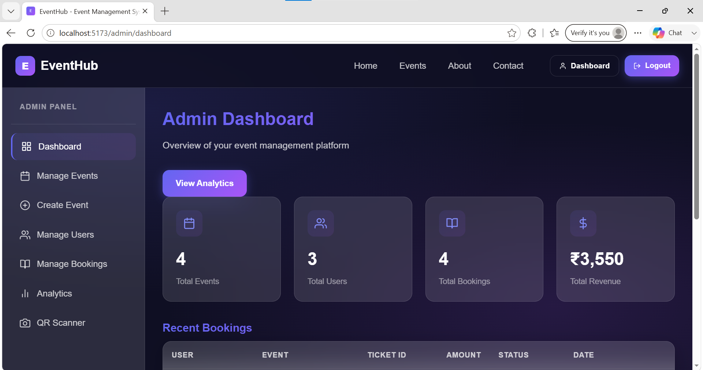
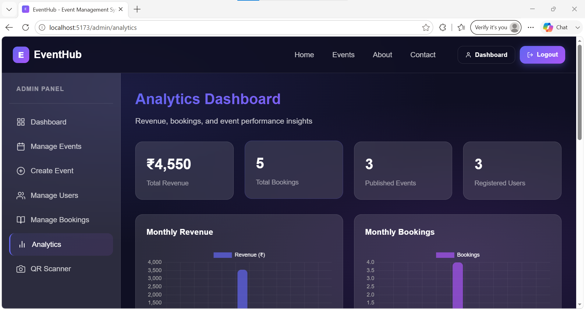

# 🎟️ EventHub

> A full-stack Event Management System built with the MERN stack that enables users to discover events, book tickets, and manage bookings while providing administrators with event management, analytics, and QR-based ticket verification.

<p align="center">


</p>

---

# 📖 Overview

EventHub is a full-stack web application designed to simplify the event management experience for both users and administrators.

Users can explore events, book tickets, and download QR-based tickets, while administrators can create and manage events, monitor bookings through analytics, and validate attendee tickets using an integrated QR scanner.

This project was developed as part of a **Web Development Internship**, focusing on practical full-stack application development using the MERN stack.

---

# 🎯 Highlights

- 🔐 JWT Authentication & Authorization
- 👥 Role-Based Access (Admin & User)
- 🎉 Event Creation & Management
- 🎫 Ticket Booking with Seat Validation
- 📱 QR Code Ticket Generation
- ✅ QR-Based Check-in Verification
- 📊 Analytics Dashboard
- 📄 PDF Ticket Download
- 📷 Event Image Upload
- 📱 Fully Responsive UI

---

# 📸 Screenshots

## Landing Page

<p align="center">

</p>

---

## Login

<p align="center">

</p>

---

## Events

<p align="center">

</p>

---

## Event Details

<p align="center">

</p>

---

## Ticket Booking

<p align="center">

</p>

---

## QR Ticket

<p align="center">

</p>

---

## Admin Dashboard

<p align="center">

</p>

---

## Analytics Dashboard

<p align="center">

</p>

---

# ✨ Features

### 👤 User

- User Registration & Login
- Browse Available Events
- View Event Details
- Ticket Booking
- Seat Availability Validation
- QR Code Ticket Generation
- Download Ticket as PDF

### 🛠 Administrator

- Role-Based Access Control
- Create, Update & Delete Events
- Publish / Unpublish Events
- Upload Event Images
- QR Ticket Verification
- Duplicate Check-in Prevention
- Revenue & Booking Analytics

---

# 🛠 Tech Stack

| Category | Technologies |
|----------|--------------|
| **Frontend** | React.js, Vite, React Router, Axios, Context API |
| **Backend** | Node.js, Express.js |
| **Database** | MongoDB, Mongoose |
| **Authentication** | JWT, bcrypt |
| **File Upload** | Multer |
| **Charts** | Chart.js |
| **Utilities** | React Toastify, html5-qrcode, jsPDF |

---

# 📂 Project Structure

```text
Event-Management-System
│
├── backend
│   ├── config
│   ├── controllers
│   ├── middleware
│   ├── models
│   ├── routes
│   ├── uploads
│   └── server.js
│
├── frontend
│   ├── public
│   └── src
│       ├── components
│       ├── context
│       ├── pages
│       ├── services
│       └── utils
│
├── images
│
└── README.md
```

---

# 🚀 Getting Started

## Clone the Repository

```bash
git clone https://github.com/msk-panigrahi/Event-Management-System.git

cd Event-Management-System
```

---

## Backend Setup

```bash
cd backend

npm install

npm run dev
```

---

## Frontend Setup

```bash
cd frontend

npm install

npm run dev
```

---

# ⚙ Environment Variables

### Backend (.env)

```env
PORT=

MONGODB_URI=

JWT_SECRET=

JWT_EXPIRE=

CLIENT_URL=
```

### Frontend (.env)

```env
VITE_API_URL=
```

---

# 🚀 Future Enhancements

- 💳 Razorpay Payment Gateway Integration
- 📧 Email Notifications
- 🔑 Google Authentication
- 🔔 Real-time Notifications

---

# 👨‍💻 Author

**Mithun Sai Kumar Panigrahi**

Developed as part of a Web Development Internship to strengthen practical experience in designing and building scalable full-stack web applications using the MERN stack.

If you found this project useful, consider giving it a ⭐ on GitHub.